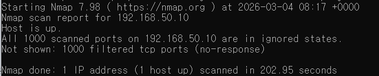
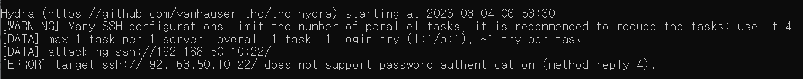
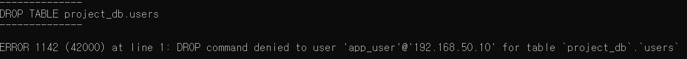
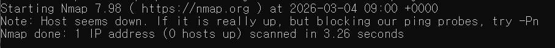

# 🛡️ Zero-Trust Architecture & Server Access Control 인프라 구축

## 📌 프로젝트 개요
단순한 방화벽(경계 방어)에 의존하는 기존 네트워크의 한계를 극복하기 위해, **"아무도 신뢰하지 않는다"는 제로 트러스트(Zero-Trust) 철학**을 기반으로 서버 및 DB 접근 제어 인프라를 구축한 프로젝트입니다. Docker 컨테이너 망 분리를 시작으로, 네트워크 라우팅, OS 계정 권한, 데이터베이스 최소 권한 부여, 그리고 백그라운드 이상 탐지 데몬까지 인프라 전반의 보안 가시성을 확보했습니다.

## 🏗️ 시스템 아키텍처 핵심 요약
* **망 분리 (Network Isolation):** 외부망(External)과 내부망(Internal)을 엄격히 분리하고, 인가된 VPN 터널을 통해서만 내부망 접근을 허용합니다.
* **마이크로 세그멘테이션:** DB 서버는 철저히 백엔드 내부망에 은닉되어, 오직 App Server만을 통해서만 접근할 수 있습니다.
* **고가용성 (HA):** Keepalived(VRRP)를 활용하여 VPN 게이트웨이의 단일 장애점(SPOF)을 제거하고 무중단 라우팅을 구현했습니다.
* **접근 통제 및 로깅:** SSH 하드닝(패스워드 완전 차단), DB 최소 권한 원칙(Least Privilege)을 적용하고, Python 기반의 백그라운드 데몬을 구축하여 OS 로그(`auth.log`)의 이상 징후를 실시간으로 탐지합니다.

---

## ⚔️ 성과 검증 (Penetration Test & Defense)
구축된 인프라가 실제 위협 상황에서 시스템을 어떻게 보호하는지 5가지 핵심 시나리오로 검증했습니다.

### 1. [망 분리] 외부망에서 내부망 직접 정찰 시도 방어
해커가 외부에서 내부망의 App Server로 Nmap 포트 스캔을 시도했으나, 논리적 망 분리 및 라우팅 부재로 인해 패킷이 완벽히 차단(Drop)되었습니다.

### 2. [제로 트러스트] 감염된 내부 기기의 SSH 무차별 대입 공격(Brute Force) 방어
VPN 라우팅이 허용된 합법적 기기(Client)가 감염되어 자동화 공격(Hydra)을 시도했습니다. "내부망 기기라도 신뢰하지 않는다"는 원칙에 따라 SSH 패스워드 인증이 원천 차단되어 즉시 공격이 무력화되었습니다.

### 3. [최소 권한 원칙] 애플리케이션 계정 탈취 후 DB 파괴(Blast Radius) 방어
해커가 App Server를 장악해 `app_user` 권한을 탈취한 뒤 `DROP TABLE` 쿼리로 데이터베이스 파괴를 시도했습니다. 철저한 권한 격리로 인해 에러(`ERROR 1142`)를 발생시키며 치명적인 데이터 손실을 방어했습니다.

### 4. [실시간 모니터링] 비정상 인증 시도 실시간 감지 및 웹훅 알림
자체 개발한 파이썬 백그라운드 데몬이 OS의 Logrotate(Inode 변경)를 견디며 `auth.log`를 실시간으로 추적합니다. 유효하지 않은 계정의 접근 실패를 즉각 낚아채어 알림을 발송합니다.

### 5. [데이터베이스 심층 은닉] 외부망에서 DB 포트(3306) 직접 연결 시도 차단
해커가 가장 중요한 데이터가 있는 DB 서버를 직접 타격하려 했으나, 마이크로 세그멘테이션 정책에 의해 외부에서는 포트조차 감지하지 못하고 연결이 타임아웃 되었습니다.

---

## 🚀 트러블슈팅 (Troubleshooting)
* **Docker 환경에서의 Keepalived 라우팅 충돌 해결:** `vpn-standby` 서버에 외부망 인터페이스를 연결할 때 발생한 라우팅 테이블 충돌(`conflicts with existing route`) 문제를 분석하고, 불필요한 VIP 할당 찌꺼기를 제거한 후 인터페이스를 명확히 분리하여 해결했습니다.
* **윈도우(CRLF)와 리눅스(LF) 포맷 충돌 해결:** 로컬 환경에서 작성한 설정 파일이 데몬 기동 실패를 유발하는 원인을 파악하고, `sed` 명령어와 Base64 인코딩 주입 기법을 활용하여 OS 간 텍스트 인코딩 지옥을 돌파했습니다.
* **파이썬 데몬의 출력 버퍼링 문제 해결:** 백그라운드(`nohup`) 실행 시 로그가 실시간으로 기록되지 않는 현상을 파악하고, `-u` (unbuffered) 옵션을 적용하여 실시간 탐지 및 알림이 누락 없이 기록되도록 개선했습니다.